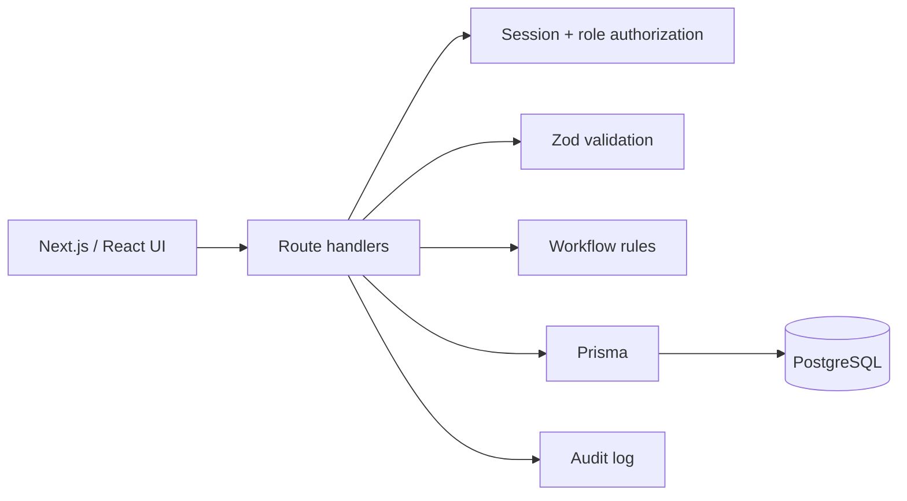

# FieldOps architecture

## Overview

FieldOps manages customers, users, sessions, work orders, and audit records in PostgreSQL. Next.js route handlers provide the API used by the React interface.

## Request flow

## Authentication

Credentials are checked against bcrypt password hashes. A successful login creates a random session token.

Only a SHA-256 hash of that token is stored in PostgreSQL. The raw token is sent in an HTTP-only, SameSite=Lax cookie. Sessions expire after seven days.

Sessions are managed server-side, so they can be invalidated without relying on client-stored claims.

## Authorization

Three roles exist:

- **ADMIN** — full operational access
- **DISPATCHER** — can create customers and work orders, assign technicians, manage queue state, and view audit activity
- **TECHNICIAN** — can view assigned work and update its status

Route handlers check these permissions before reading or changing protected data.

## Work-order rules

Status transitions are defined in `src/domain/work-order.ts`.

Assigning a technician to an open work order moves it to `ASSIGNED`. Removing the assignee from an assigned work order returns it to `OPEN`. Completed and cancelled work orders are terminal states.

## Persistence

Prisma maps users, sessions, customers, work orders, and audit entries to PostgreSQL. Foreign keys and indexes support queue, ownership, and history queries.

## Audit log

Customer creation and work-order changes write an audit record with the acting user, entity, timestamp, and relevant before/after values.

## Current limitations

FieldOps does not currently include:

- login rate limiting
- password reset or user invitations
- email/SMS notifications
- file attachments
- pagination for large queues
- a migration/release workflow beyond Prisma `db push`
- structured application monitoring
- end-to-end browser tests
