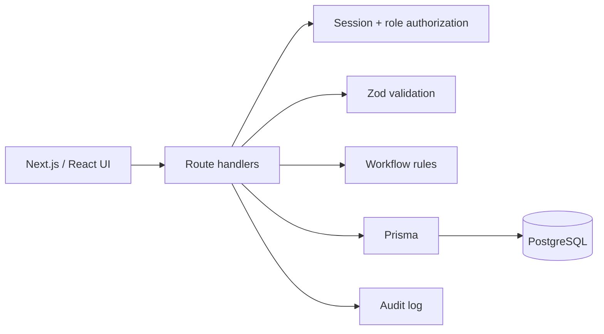

# FieldOps architecture

## Purpose

FieldOps is an internal work-order platform intended to demonstrate the structure of a real multi-user business application rather than a single-user CRUD demo.

## Request flow

## Authentication

Credentials are verified with bcrypt password hashes. Successful login creates a cryptographically random opaque session token. Only a SHA-256 hash of the token is stored in PostgreSQL; the raw token is sent in an HTTP-only, SameSite=Lax cookie. Sessions expire after seven days.

This is intentionally server-managed session authentication rather than a client-stored JWT.

## Authorization

Three roles exist:

- **ADMIN** — full operational access.
- **DISPATCHER** — create customers/work orders, assign technicians, manage queue state, view audit activity.
- **TECHNICIAN** — can only view assigned work and update its status.

Route handlers enforce these boundaries server-side. The UI hiding a control is not treated as authorization.

## Domain rules

Work-order state transitions are centralized in `src/domain/work-order.ts`. Terminal states cannot be reopened through the normal workflow.

Assigning an unassigned open work order automatically moves it to `ASSIGNED`. Removing the assignee from an assigned order returns it to `OPEN`.

## Persistence

Prisma maps users, sessions, customers, work orders, and audit entries to PostgreSQL. Foreign keys and indexes support common queue and history lookups.

## Auditability

Customer creation and work-order creation/changes write audit entries with the acting user, entity, timestamp, and before/after operational state where relevant.

## Tradeoffs and production next steps

This portfolio version intentionally keeps scope bounded. A production rollout would add:

- account lockout/rate limiting on authentication
- CSRF/origin hardening for state-changing requests
- password reset and invitation workflows
- email/SMS notifications
- attachment/object storage
- pagination for large queues and audit streams
- database migrations with a release process rather than `db push`
- structured observability and alerting
- end-to-end browser tests

These are documented as next steps rather than implied to already exist.
